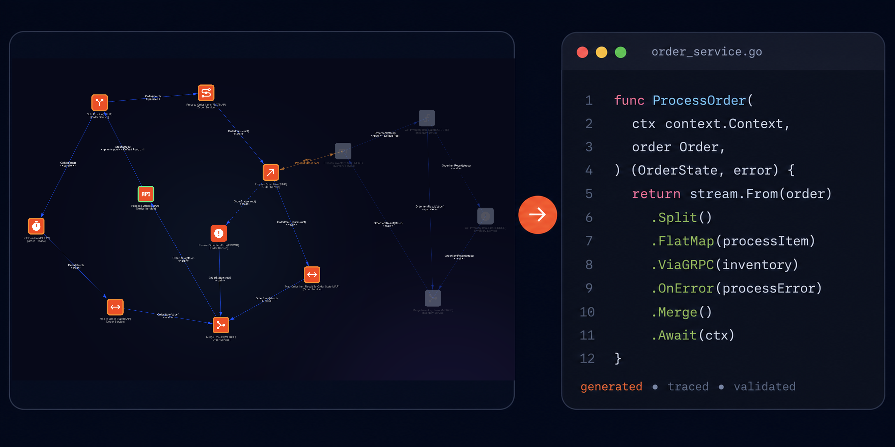

<div align="center">

# ServiceLib for Go

**The runtime library powering [Service Architect](https://www.gorundebug.com)**

[](https://golang.org/)
[](LICENSE)
[](https://opentelemetry.io/)
[](https://prometheus.io/)



</div>

---

## About

Service Architect is a visual designer and code generator for distributed systems. You draw a graph of services, pipelines, and connections; the designer generates complete projects for Go, Rust, C++, and Python. The Go target uses **ServiceLib** as its runtime.

Think of it as React for distributed backend systems: you describe the structure, the framework handles the wiring, you implement business logic. Every execution is traced through the same graph you drew.

> **The graph is the architecture. It runs the system. It is always accurate by definition.**

This library is not meant to be used directly. It is a dependency of code generated by Service Architect.  
→ **[Open Service Architect](https://www.gorundebug.com)**

---

## The Problem It Solves

Building a production Go service for the Order Service pipeline below requires writing roughly this by hand:

```go
func (s *OrderService) processOrder(ctx context.Context, req *ProcessOrderRequest) (*ProcessOrderResponse, error) {
    ctx, cancel := context.WithTimeout(ctx, s.cfg.RequestTimeout)
    defer cancel()

    span, ctx := s.tracer.Start(ctx, "processOrder")
    defer span.End()

    softDeadline := time.NewTimer(s.cfg.SoftDeadlineDuration)
    defer softDeadline.Stop()

    type result struct {
        item *pb.ProcessOrderItemResponse
        err  error
    }
    results := make(chan result, len(req.Items))

    var wg sync.WaitGroup
    for _, item := range req.Items {
        wg.Add(1)
        go func(item OrderItem) {
            defer wg.Done()
            res, err := s.inventoryClient.ProcessOrderItem(ctx, &pb.ProcessOrderItemRequest{
                Sku: item.SKU, Quantity: int32(item.Qty),
            })
            results <- result{res, err}
        }(item)
    }
    go func() { wg.Wait(); close(results) }()

    var confirmed []OrderItemResult
    received, status := 0, "CONFIRMED"
    for received < len(req.Items) {
        select {
        case r, ok := <-results:
            if !ok { goto done }
            if r.err != nil { s.metrics.itemErrors.Inc(); received++; continue }
            if !r.item.Reserved { status = "PARTIALLY_CONFIRMED" }
            confirmed = append(confirmed, mapResult(r.item))
            received++
        case <-softDeadline.C:
            status = "TIMED_OUT"; goto done
        case <-ctx.Done():
            status = "TIMED_OUT"; goto done
        }
    }
done:
    s.metrics.ordersTotal.WithLabelValues(status).Inc()
    span.SetAttributes(attribute.String("order.status", status))
    return &ProcessOrderResponse{OrderID: uuid.New().String(), Status: status, ConfirmedItems: confirmed}, nil
}
```

goroutines, WaitGroups, timeouts, gRPC wiring, tracing, metrics, error aggregation — all manual.

The same pipeline as a graph:

```
HTTP Input · Process Order
        ↓
    Split Pipeline
      ↙         ↘
FlatMap       Delay · Soft Deadline
   ↓               ↓
gRPC Sink      Map · Order State
   ↓
Map · Item Result
      ↘         ↙
      Merge Results → Response
```

6 nodes. The goroutines, timeouts, gRPC wiring, tracing, and metrics are generated. **You implement only the business logic.**

---

## What You Actually Write

```go
// inventory service — the only file you write
func (f *GetInventoryItemData) Process(
    _ context.Context,
    _ runtime.Stream,
    value *types.OrderItem,
    out  runtime.Collect[*types.OrderItemResult],
    rout runtime.Collect[*types.OrderItemResult],
) {
    result, err := f.db.ReserveStock(value.SKU, value.Quantity)
    if err != nil || !result.Reserved {
        rout.Collect(&types.OrderItemResult{
            SKU: value.SKU, Status: "OUT_OF_STOCK",
            AvailableQty: result.AvailableQty,
        })
        return
    }
    out.Collect(&types.OrderItemResult{
        SKU: value.SKU, Reserved: true, Status: "CONFIRMED",
        AvailableQty: value.Quantity,
    })
}
```

Pure business logic. Inputs, outputs, error path — all defined by the graph.  
No HTTP routing. No transport handling. No serialization. No span management. No metric registration.

---

## Every Request, Traced Through The Graph

Execution traces run through the exact nodes defined in the graph. There is no separate graph-specific tracing layer to maintain.

```
▶ POST /v1/processorder · ord-9f3a1c · 2 items

 0ms  ├─ Input · Process Order       ✓  order{id: ord-9f3a1c, items: 2}
 1ms  ├─ Split Pipeline              ✓  → 2 branches

      │ parallel branch · per item
 2ms  │ ├─ FlatMap · Order Items     ✓  × 2 emitted
 4ms  │ ├─ gRPC Sink · Inventory     ✓  ITEM-001 reserved · ITEM-042 reserved
18ms  │ └─ Map · Item Result         ✓  2× CONFIRMED

      │ timeout branch · not reached
 1ms  │ ├─ Delay · Soft Deadline     ⏱  25ms deadline — not fired
  –   │ └─ Map · Order State         –  skipped

20ms  └─ Merge Results               ✓  CONFIRMED · 2/2 items · → response

Total: 22ms
```

Parallel branches, timeout paths, error streams — all visible as branches in the trace, mirroring the graph structure exactly.

---

## Node Operators

| Operator | Purpose |
|---|---|
| `Input` | Receive data from external systems (HTTP, gRPC, Kafka) |
| `Sink` | Send data to external systems |
| `Map` | Transform one value into another |
| `Filter` | Conditionally pass values |
| `FlatMap` | Expand one value into multiple |
| `Process` | Transform with a side error output stream |
| `KeyBy` | Partition stream by key |
| `Join` | Combine two keyed streams |
| `MultiJoin` | Combine multiple keyed streams |
| `Merge` | Merge multiple streams into one |
| `Split` | Duplicate a stream into multiple consumers |
| `Case` | Branch by condition |
| `Delay` | Deferred delivery with timeout path |
| `CycleLink` | Feedback loops |
| `Error` | Capture the error stream of a `Process` node |

---

## Connectors

**Sources** — HTTP · gRPC (unary, client-streaming, server-streaming, bidi) · Kafka · Local in-process

**Sinks** — HTTP · gRPC · Kafka · Local in-process

Every connector follows the same lifecycle:

```
BeginRequest → ConsumeMessage → HandleResponse → EndRequest
```

---

## Observability — Generated, Not Configured

### Distributed Tracing (OpenTelemetry)

Automatic spans at every layer:

```
grpc.server                          ← transport, via otelgrpc
  └─ grpc.input                      ← endpoint  {stream, endpoint, stream_id}
       └─ stream.call                ← operator  {stream}
            └─ stream.call
                 └─ grpc.output      ← sink  {stream, endpoint}
                      └─ grpc.client ← transport, via otelgrpc
```

Per-request sampling is opt-in via a non-empty `X-Trace` header (HTTP),
non-empty `x-trace` metadata (gRPC), or an already sampled W3C remote parent.
Without one of these signals ServiceLib creates no recording request,
operator, pool, source, or sink spans.

### Metrics (Prometheus)

Datasource endpoint metrics (`datasource_endpoint_*`):

| Metric | Type | Description |
|---|---|---|
| `messages_total` | counter | Successfully processed messages |
| `request_duration_seconds` | histogram | Request duration |
| `active_requests` | gauge | Requests in flight |
| `pending_requests` | gauge | Requests awaiting a pipeline result |
| `pending_oldest_age_seconds` | gauge | Age of the oldest pending request (computed at scrape time) |
| `events_total{event=...}` | counter | `request_error` · `late_result` · `missing_stream_id` · `unknown_message_id` · `duplicate_message_id` · `begin_request_failed` |

### Grafana Dashboards

11 pre-built Jsonnet dashboards generated per service:

```
01_service        Service health overview
02_streams        Operator-level metrics
03_datasource     Source endpoints + pending visibility
04_datasink       Sink endpoints
05_pools          Worker pool utilization
06_storage        Storage layer
07_http_server    HTTP server transport
08_http_client    HTTP client transport
09_grpc_server    gRPC server transport
10_grpc_client    gRPC client transport
11_runtime        Go runtime — GC, goroutines, memory
```

---

## Not a Workflow Engine

The first question: *"How is this different from Temporal or Dapr?"*

| | Temporal / Dapr | Service Architect |
|---|---|---|
| Primary use case | Long-running workflows, sagas, compensation | Request processing pipelines, service orchestration, parallel fanout, event processing |
| Central server | Required (Temporal/Cadence cluster) | None — standard Go binary, no sidecar |
| Observability | Separate UI, separate traces | Architecture graph IS the trace — same diagram |
| Code ownership | Framework controls execution model | You own all generated code, no lock-in |
| Architecture source of truth | Lives in code and workflow definitions | Graph is the single source of truth |

---

## AI-Assisted Implementation

Generated stubs are designed to be implemented by AI:

```go
// MakeGetInventoryItemData is instantiated once at startup.
// Fields are not protected by any synchronization.
func MakeGetInventoryItemData(
    ctx context.Context,
    env environment.ServiceEnvironment,
    cfg *runtimecfg.ProcessStreamConfig,
) (*GetInventoryItemData, error) {
    return &GetInventoryItemData{}, nil
}
```

- Explicit named types with clear inputs and outputs
- `TODO` markers with full function description from the graph
- Compile-time interface validation (`var _ transformation.ProcessFunction[...] = (*GetInventoryItemData)(nil)`)

AI gets one bounded function. The graph enforces scope. No invented architecture, no unknown dependencies.

---

## Visual Designer

→ **[gorundebug.com](https://www.gorundebug.com)**

---

## Status

| | |
|---|---|
| ✅ Runtime engine | Typed operators, lifecycle, concurrency |
| ✅ Connectors | HTTP · gRPC · Kafka · Local |
| ✅ Observability | OpenTelemetry tracing · Prometheus metrics · Grafana dashboards |
| ✅ Live graph visualization | Running service exposes its own topology |
| 🧪 Code generator | Beta |

---

## Documentation

| | |
|---|---|
| [Architecture Reference](docs/architecture-reference.md) | Runtime internals, execution model, lifecycle |
| [DSL Reference](docs/dsl-reference.md) | Topology YAML — nodes, edges, connectors, types |
| [LLM Reference](docs/architecture_llm.md) | Condensed reference for AI-assisted development |
| [Go example](https://github.com/gorundebug/goexample) | Generated Go services and runnable infrastructure |
| [Rust example](https://github.com/gorundebug/rustexample) | Equivalent generated services using the Rust runtime |
| [C++ example](https://github.com/gorundebug/cppexample) | Equivalent generated services using the C++/userver runtime |
| [Python example](https://github.com/gorundebug/pyexample) | Equivalent generated services using the Python/asyncio runtime |
| [Presentation](https://canva.link/u35soxhu2j96003) | Overview slides |
| [Video](https://www.youtube.com/watch?v=fNv2Jz8lHiw) | Demo video |

---

## License

BSD-3-Clause. See [LICENSE](LICENSE).

---

## Contacts

| | |
|---|---|
| 🌐 | [gorundebug.com](https://www.gorundebug.com) |
| ✉️ | [serlex777@gmail.com](mailto:serlex777@gmail.com) |
| ✈️ | [t.me/+31qMliw-DeI3M2M6](https://t.me/+31qMliw-DeI3M2M6) |
